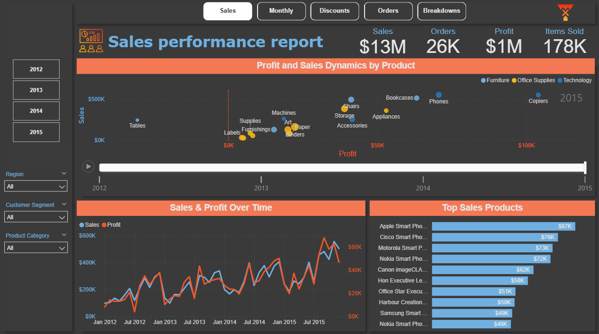
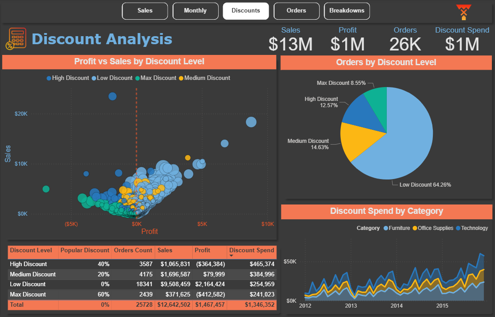

# 📊 Global Superstore Sales & Profit – Power BI Dashboard

## 🎯 Project Objective

   Comprehensive sales and profitability analysis for global operations, providing actionable insights for Sales Management and Operations Teams.   
   This Power BI dashboard visualizes key business performance metrics across multiple dimensions, identifying profit drivers, optimal discount strategies, and regional performance patterns to support data-driven decision making.

---

## 📋 Dashboard Overview
### ✅ Dashboard Structure
- Sales Performance Report - Product-level dynamics
- Monthly Sales - Time-series performance tracking
- Discount Analysis - Discount impact on profitability
- Orders Analysis - Order patterns and shipping insights
- Sales Drivers & Breakdown - Sales performance decomposition
- Profit Drivers & Breakdown - Hierarchical profit analysis
- Details – Interactive drill-down page allowing users to explore specific product categories, regions, or customer segments selected from other dashboard charts for deeper insights. 

### 🔍 Key Performance Indicators
- Total Sales
- Total Profit
- Total Orders
- Items Sold
-  Profit Margin
-  Average Sale
-  Discount Spend
-  Shipping Cost
-  Profit after Delivery Cost
-  Return Rate

### 🎛️ Interactive Filtering Options
- Time Period (2012-2015)
- Region (Global coverage)
- Customer Segment: Consumer / Corporate / Home Office
- Product Category : Furniture / Office Supplies / Technology
- Location Hierarchical drill-down: Market → Region → Country → State → City
- Product Hierarchical drill-down: Category → Sub-Category → Product Name
- Metric Type (Sales / Profit / Items Sold / Orders)

---

## 📈 Key Findings

### 📈 Temporal Trends
- Both sales and profit demonstrate a steady upward trend between 2012 and 2015, reflecting overall business expansion and stronger market penetration.
- The Phones and Copiers categories stand out as the strongest revenue drivers, consistently delivering the highest sales and profit margins across the observed period.
- In contrast, the Tables (Furniture) category shows the lowest sales volumes.
- Heavy discounting practices have led to significant margin erosion, resulting in negative profit contribution despite stable demand.   

### 📈🛒 Top Selling Products:
- Apple Smart Phone
- Cisco Smart Phone
- Motorola Smart Phone
- Nokia Smart Phone
- Canon Image Copier   

### 📅💰 Monthly Sales

- The highest Sales Share of year-to-date sales is typically concentrated in February (43–50%), after which a gradual decline is observed towards the end of the year.
- This pattern highlights a strong seasonal effect early in the year, which tapers off in subsequent months.
- The most remarkable MoM growth occurred in August, with Sales +108.7% (August 2013) and Profit +554.7% (August 2012), indicating a period of exceptional business acceleration. In contrast, the weakest performance was recorded in January and July, where sales dropped by –57% (January 2013) and profit by –80.7% (July 2012), suggesting volatile demand cycles.
-  The average profit margin remained steady at ~11.6%, reflecting overall business resilience. However, an exceptionally low margin of 3.4% in July 2012 signals a period of inefficient cost management or aggressive discounting.

### 💰 Discount Analysis
   
- Maximum discount (60%) generates negative profit (-$412,582).
- High Discount (40%): generates negative profit (-$364,384).   
- Low Discount (0%): Best profit margin with $2.16M profit.
- Medium Discount (20%): Balanced approach with $79,999 profit.   

### 📦 Orders & Returns

- About 26,000 orders, with an average return rate of 4–5%.
- Highest Profit: Western Europe, followed by Eastern and Southern Asia, Central America and US regions.
- High return rates in Southern Europe, Southern Africa, Eastern and Southern US (5%).

### 🚚 Shipping & Operations
- Shipping costs total $1M, reducing profit after delivery to $109K.
- The most unprofitable category after delivery — Furniture (–$156K).
- Standard Class makes more then 60% of profit and is the only shipping method that remains profitable after delivery costs, generating approximately $270K. This indicates that it is the most cost-efficient option, balancing both demand and logistics expenses.
- First Class (–$100K), Same Day (–$40K), and Second Class (–$22K) all result in losses after accounting for delivery costs. Despite higher service levels, these shipping methods appear to be financially unsustainable under the current pricing model.

### 💰 Sales c Geography

- Total sales — $13M, strongest regions are Western Europe, Central America, and Oceania.
- Leading country — France ($863K), especially Paris ($63K).
- Main category — Office Supplies ($23K): Appliances, Storage,  Art.

### 📉 Profit

   Turkey shows negative profit (–$98K).   
   Loss-making cities include Istanbul, Ankara, Izmir, Bornova.   
Most problematic categories:    
- Office Supplies: Appliances, Art.
- Furniture: Bookcaces, Chairs.
- Technology: Machines, Copiers, Phones, Accessories.   

   By switching to the hidden “Details” page, users can drill down into specific product categories selected from other dashboard charts.

---

## ✅ Recommendations

1. **Sales and Product Strategy**
   - Focus on high-margin categories: Phones and Copiers show consistent sales growth and profitability. Increase assortment, promotions, and marketing efforts for these categories.
   - Optimize Furniture (Tables): Low sales volumes and losses indicate the need to either redesign the offering (reduce inventory, select more popular models) or adjust pricing strategies.
   - Product promotions: Sales perform best with minimal or moderate discounts (0–20%). Aggressive discounting (40–60%) results in significant losses. Limit maximum discounts to 20%, using deep discounts only for seasonal clearance.

2. **Seasonality and Sales Planning**
   - Peak months: February and August show the highest sales and MoM growth. Plan marketing campaigns, inventory, and staffing around these peaks.
   - Low months: January and July show weak sales and profits. Use these months for internal optimizations, product refreshes, or targeted promotions to smooth seasonal fluctuations.

3. **Discounts and Profitability**
   - Optimal discounts: 0–20% provides a balance between sales volume and profit.
   - Avoid excessive discounts: 40–60% discounts lead to negative profits. Restrict these for clearance events only, not regular practice.

4. **Logistics and Shipping**
   - Prioritize Standard Class: The only shipping method profitable after delivery costs.
   - Unprofitable shipping methods: First Class, Same Day, and Second Class incur losses. Consider increasing rates or limiting these options for low-margin categories.
   - Optimize shipping costs: Review routes and carrier agreements to reduce the $1M delivery expense.

5. **Geographic Strategy**
   - Strong regions: Western Europe, Central America, and Oceania — focus marketing and inventory resources here.
   - Loss-making regions: Turkey, Southern Europe, Southern Africa, and some US cities require a review of pricing, logistics, and product assortment to address profitability.

6. **Reduce Returns**
   - Improve packaging and delivery reliability.
   - Provide accurate product descriptions and images.
   - Analyze return reasons by category to reduce losses.

---

## 👥 Target Audience

- C-Suite Executives - Strategic overview and crisis management
- Operations Team - Shipping and fulfillment optimization (PRIORITY)
- Sales Management - Regional and product performance
- Finance Department - Profitability analysis and cost control
- Supply Chain Team - Logistics optimization
- Marketing Team - Campaign and discount effectiveness   

---

## 🧰 Tools Used

- **Power BI Desktop & Service**
- **Data Source:** [store_dataset](store_dataset.xlsx)

---

## 📌 How to Run

1.  Download the file.
2. Open it using Power BI Service / Desktop.
3. Interact with filters and explore dashboard.

---

## 🙌 Contributions

Analysis by: **Nataliia Yarema**  
